<p align="center">
  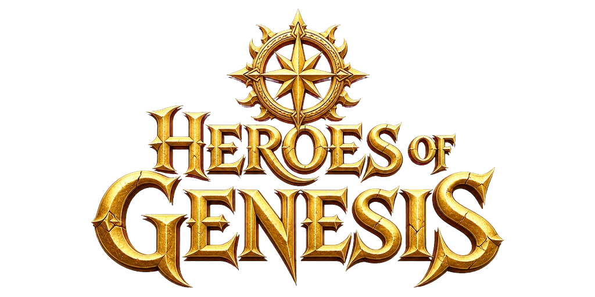
</p>

<p align="center">
  <b>A dark fantasy card RPG that runs entirely inside Decentraland.</b><br/>
  Recruit legendary heroes, party up with friends, and walk the Roads.<br/>
  Every battle can drop a collectible, and every hero is yours to keep.
</p>

<p align="center">
  <a href="https://decentraland.org/play/?realm=hogdemo.dcl.eth"><b>&#9654;&nbsp; Play the demo</b></a>
  &nbsp;&middot;&nbsp; World: <code>hogdemo.dcl.eth</code>
  &nbsp;&middot;&nbsp; 100% mobile
  &nbsp;&middot;&nbsp; Free to play
</p>

<p align="center"><i>Built for the <b>Regenesis Labs Build Contest</b>.</i></p>

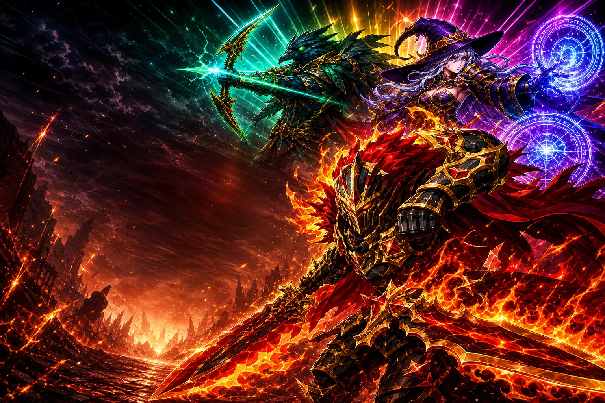

## What it is

Heroes of Genesis is a full collectible-hero RPG built as a single Decentraland SDK7 scene. You swear an oath to your first hero on the start screen, then build a party and fight through the Roads — floor-by-floor dungeon climbs that end in a boss. Bosses drop hero cards, chests drop hero cards, festivals drop hero cards. Duplicates aren't dead weight: fuse them into rarer, stronger forms.

Everything is designed phone-first. Hold the phone portrait and the whole game — combat, menus, trading, raids — plays like a native mobile card RPG, streamed through Decentraland with no install.

## Features

### Walk the overworld

Clear the first Road and Antrom Green opens: a top-down world you walk tile by tile with the other players in the scene. Ten hand-painted realms — two villages (one under snow), wilds and a fen, a crow-haunted road, the Moor Gate, four dungeons — with villagers to talk to, chests to find, and a five-quest storyline paid in cards. Every monster you fell has a chance to leave its own card behind (roamers rarely, path guards more often, and the warlords once you have beaten the story and they stand again). Dungeons are real puzzles: push stones onto marks to open gates, find the key for a sealed door, hop one-way ledges, and walk under the painting's own arches. The world is shared — any player's kill clears a blocked path for everyone — but the warlords at the end of each act are yours to fell. Finish the line and the credits roll; the warlords stand again for another run, this time dropping their own cards.

### Raid with friends

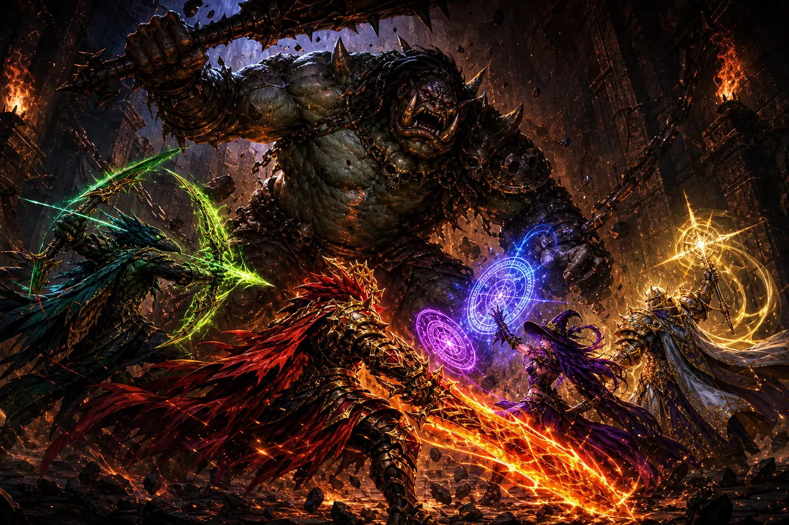

Assemble a live party and descend into the Rift. Chain your heroes' skills — flame strikes, sigil storms, volleys of emerald arrows — and bring down bosses no one survives alone. Every raider walks away with spoils, and the floors get deeper and deadlier.

### Trade face-to-face

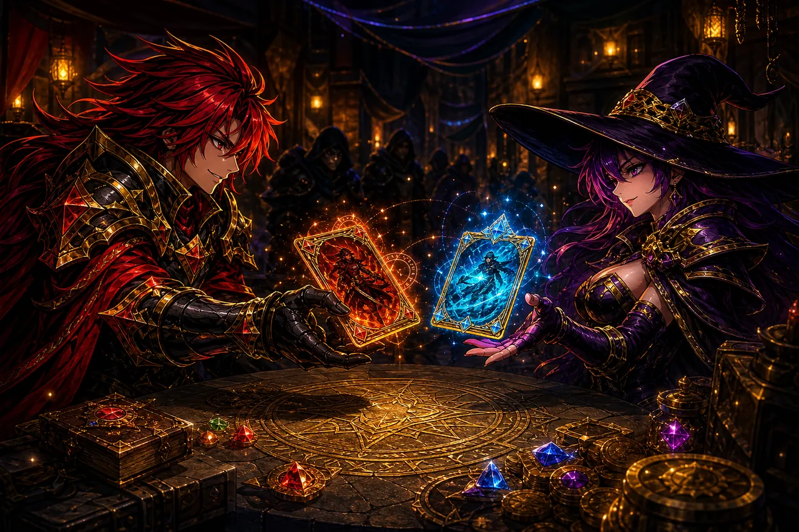

Sit across a real player at the trading table. Offer your cards, lock your side of the deal, and shake on it. No middlemen, no market bots — a lock-in system keeps every deal fair.

### Festivals, realm goals & daily gifts

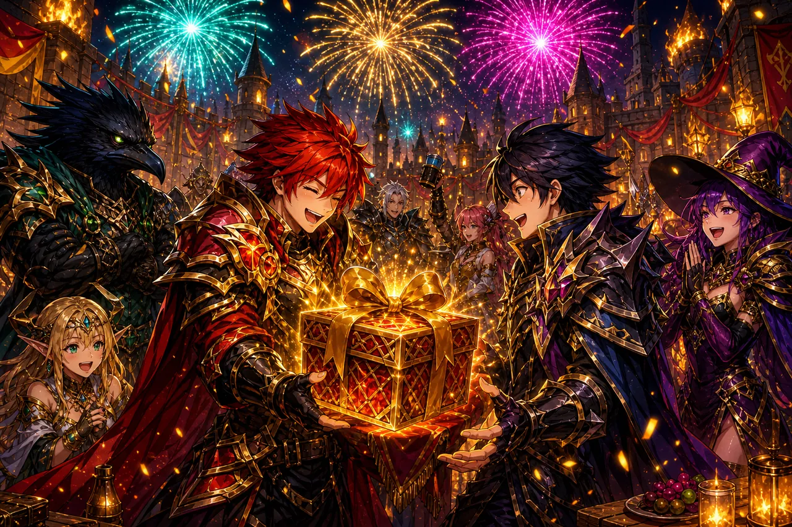

Join realm-wide festivals where the whole server pushes toward one goal. Send daily gifts to friends, open the ones they send back, and climb the event track for rewards nobody earns alone.

### Fuse duplicates into legends

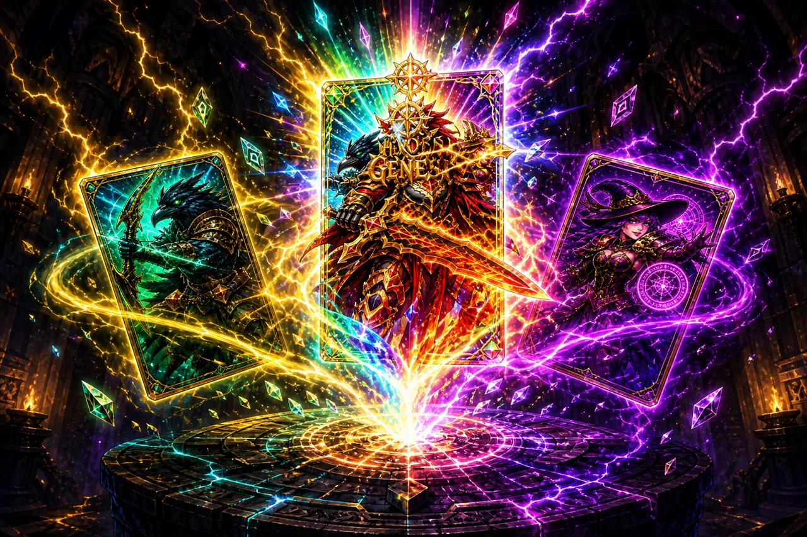

Every chest, raid, and road drops hero cards. Stack duplicates and fuse them into rarer forms, then inspect every hero in their own hall with full art and battle stats.

### Climb the Roads — then climb them again

Each Road ends in a boss. Beat it and the Road ascends to a higher star tier: tougher enemies, richer coin, better drops. Master a Road at five stars and your oath hero ascends with it. A tier picker lets you replay any tier you've conquered to farm the drops you're missing.

### Wear the set, earn the hero

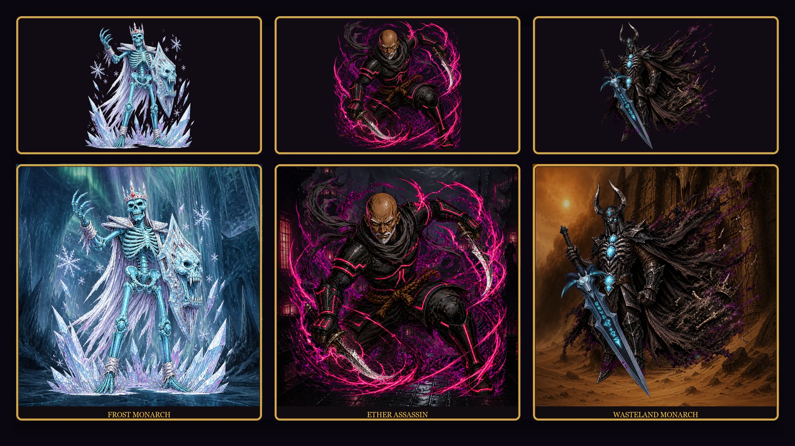

Three heroes never drop from packs, roads, rifts, or trades. Own the **full** Decentraland wearable set and the hero card joins your collection. Sell or transfer a piece and the card leaves with it.

| Hero | Role | Wearable set |
| --- | --- | --- |
| **Frost Monarch** | Legendary support | [Helm & body](https://market.decentraland.org/contracts/0x0e9663c4b53ed79b343739b5bafab89666ee8ba3) · [Shield](https://market.decentraland.org/contracts/0x0897430acd7bfc81bdcf51e815db8f0f53c94878) |
| **Ether Assassin** | Legendary melee | [Armor set](https://market.decentraland.org/contracts/0x0bf152a83a6fc55066c2b664b164ca2916ad38f5) |
| **Wasteland Monarch** | Mythic support | [Helm, armor & pants](https://market.decentraland.org/contracts/0xf8a87150ca602dbeb2e748ad7c9c790d55d10528) |

Locked teasers sit on the PARTY bench. Tap one to see which pieces you still need. Ownership is read from your wallet (owned wearables, not just equipped). Guests cannot unlock these cards. NFT heroes are untradable — the wearables are the only door in.

## Inside the game

| Clash battles | Build your party | Open chests |
| :---: | :---: | :---: |
| 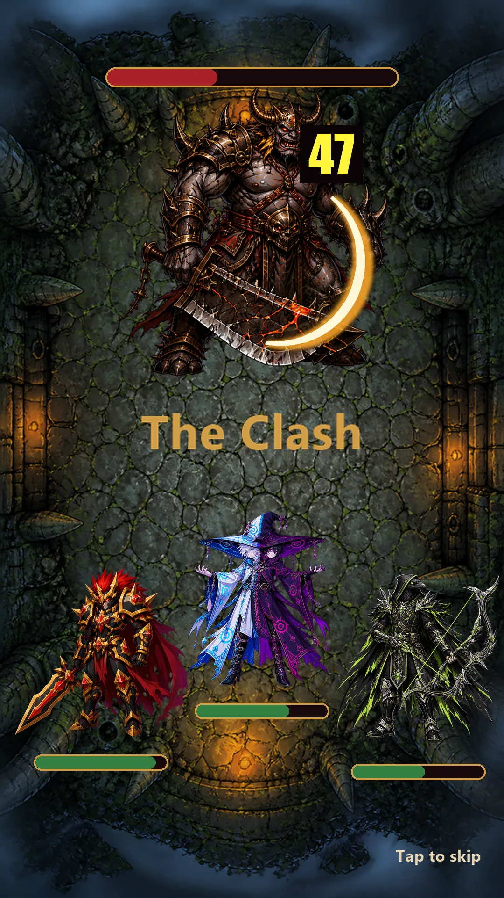 | 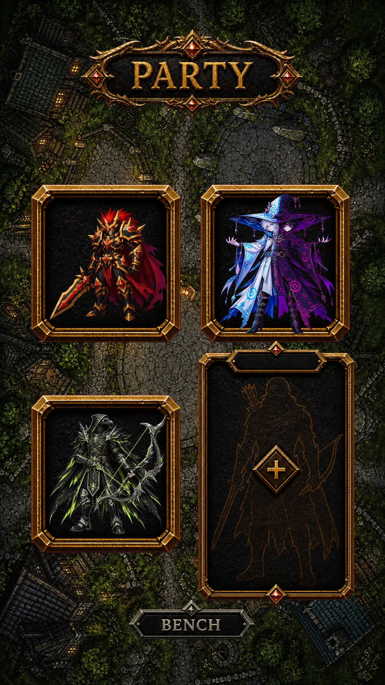 | 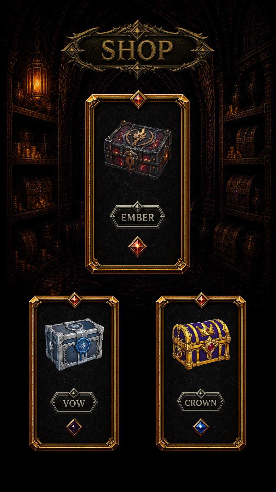 |

## 100% mobile

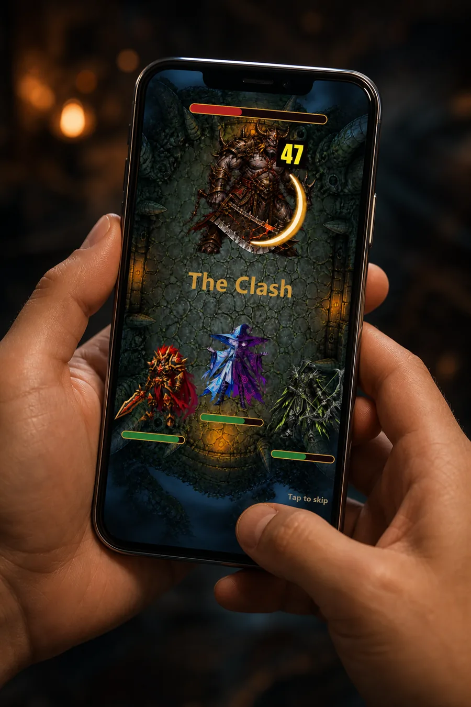

The full game is in your pocket: same raids, trades, and festivals on phone or desktop, same account, same heroes — straight from the browser.

## Run it locally

```
npm install
npm run start
```

Open the Decentraland preview, hold the phone portrait (or narrow the window), and swear in on the start screen.

## Tech notes

- **Decentraland SDK7** scene with an authoritative multiplayer server (`src/server`) — saves, trades, festivals, and raids are validated server-side.
- **React-ECS UI**: the entire game is a screen-space UI rendered over a minimal 3D shell, tuned for portrait phones.
- **Hand-built art pipeline**: every screen, button, and label is pre-rendered imagery; combat uses sprite-sheet flipbooks for hero attack animations. Overworld maps are painted from ASCII collision layouts (`tools/render-ow-layout.ps1` → painting → `tools/process-ow-map.ps1`), and each dungeon puzzle is verified solvable by a BFS solver before it ships.
- **Energy is uncapped in this build**: there is no regen timer yet, so the energy bar never blocks play.
- Deployed to the Decentraland World <code>hogdemo.dcl.eth</code>.
